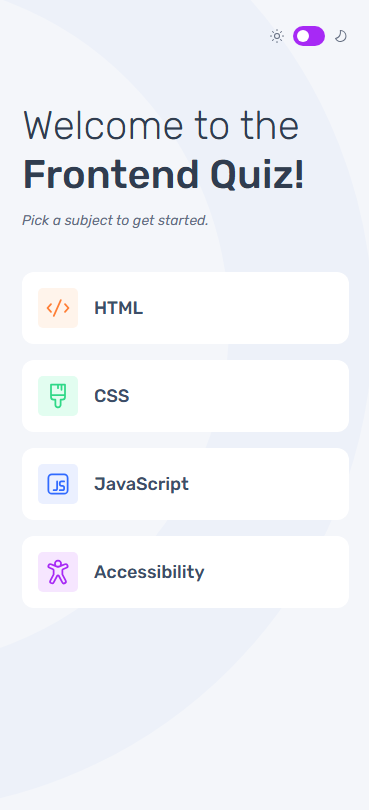
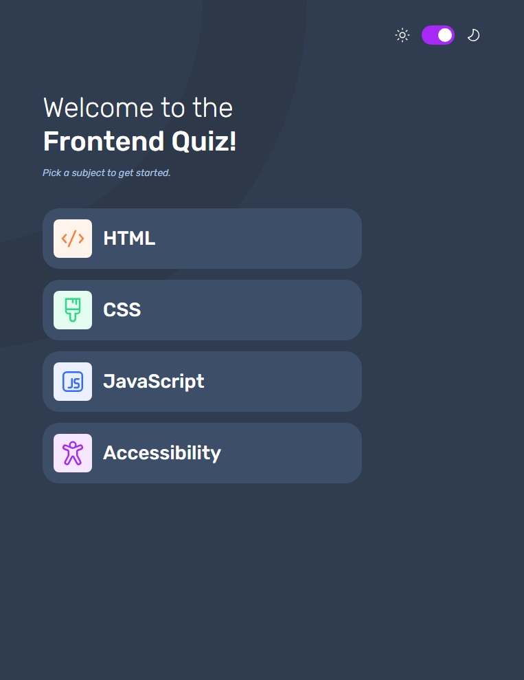
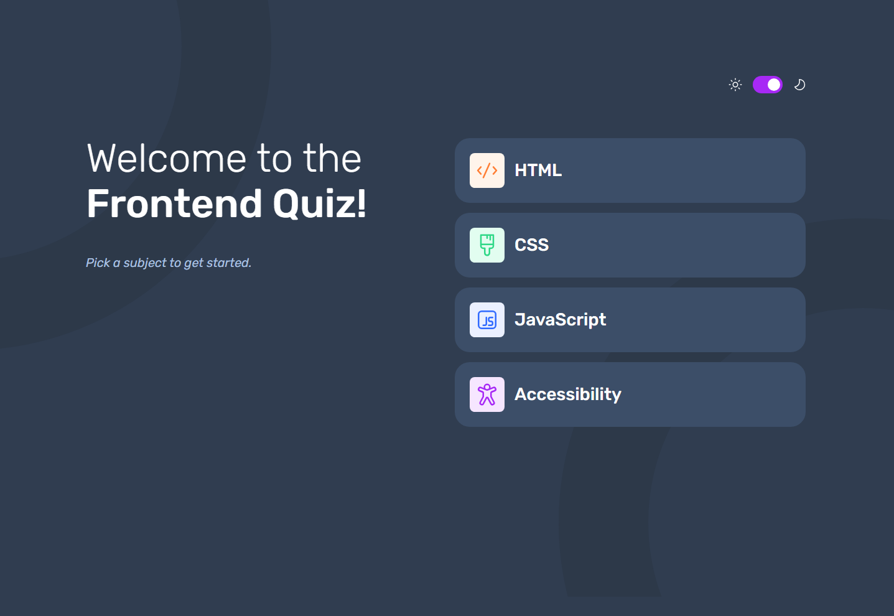

# Frontend Mentor - Frontend quiz app solution

This is a solution to the [Frontend quiz app challenge on Frontend Mentor](https://www.frontendmentor.io/challenges/frontend-quiz-app-BE7xkzXQnU). Frontend Mentor challenges help you improve your coding skills by building realistic projects. 

## Table of contents

- [Overview](#overview)
  - [The challenge](#the-challenge)
  - [Screenshot](#screenshot)
  - [Links](#links)
- [My process](#my-process)
  - [Built with](#built-with)
  - [What I learned](#what-i-learned)
  - [Continued development](#continued-development)
- [Author](#author)

## Overview

### The challenge

Users should be able to:

- Select a quiz subject
- Select a single answer from each question from a choice of four
- See an error message when trying to submit an answer without making a selection
- See if they have made a correct or incorrect choice when they submit an answer
- Move on to the next question after seeing the question result
- See a completed state with the score after the final question
- Play again to choose another subject
- View the optimal layout for the interface depending on their device's screen size
- See hover and focus states for all interactive elements on the page
- Navigate the entire app only using their keyboard
- **Bonus**: Change the app's theme between light and dark

### Screenshot

### Links

- Solution URL: [https://www.frontendmentor.io/solutions/responsive-frontend-quiz-app-DdFGg7gT50](https://www.frontendmentor.io/solutions/responsive-frontend-quiz-app-DdFGg7gT50)
- Live Site URL: [https://mateusrissodiblasio.github.io/frontend-quiz-app](https://mateusrissodiblasio.github.io/frontend-quiz-app)

## My process

### Built with

- Semantic HTML5 markup
- CSS custom properties
- Flexbox
- CSS Grid
- Mobile-first workflow

### What I learned

Data Manipulation, to achieve the expected result had to learn to filter info, compare variables based on element choosal, implement theme toggle. Obviously I can improve it by refactoring my code, but I'm satisfied on how much my knowledge has increased.

### Continued development

Prevent timeloss on html structure, assimilate project objectives, as displaying sizes, and how to assembly making it easier.

## Author

- GitHub - [Mateus Risso Di Blasio](https://github.com/MateusRissoDiBlasio)
- Frontend Mentor - [@MateusRissoDiBlasio](https://www.frontendmentor.io/profile/MateusRissoDiBlasio)